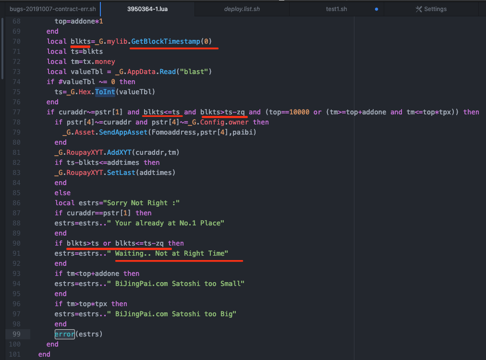
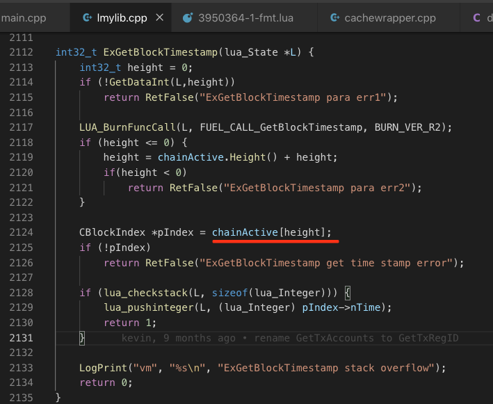

2019.10.17，coind-2.0版本，矿工节点n1，无法同步最长链，错误日志有多处如下错误：

```
2019-10-06 04:10:10 [tx/contracttx.cpp:255]ERROR: CLuaContractInvokeTx::ExecuteTx, txid=8faced3d4096609e2bb52e23abb8dc35306e4a55825b9247fadb18cf1252803f run script error:lua_pcallk failed: [string "line"]:99: Sorry Not Right : Waiting.. Not at Right Time
2019-10-06 04:10:10 [main.cpp:1253]ERROR: ConnectBlock() : txid=8faced3d4096609e2bb52e23abb8dc35306e4a55825b9247fadb18cf1252803f ex
ecute failed, in detail: txType=LCONTRACT_INVOKE_TX, hash=8faced3d4096609e2bb52e23abb8dc35306e4a55825b9247fadb18cf1252803f, ver=1,
txUid=3901759-1, app_uid=3950364-1, coin_amount=0, llFees=1000008, arguments=f0160000575778787878787878787842694a696e67506169787878
787878787878796f33336200f02f332ceb0300, valid_height=4017157
2019-10-06 04:10:10 [main.cpp:1965]ERROR: ProcessForkedChain() : ConnectBlock c62661eefbda8254d6d82b6a8f6dbac9e044c4f44b7d089f727717a0167428d3 failed
2019-10-06 04:10:10 [main.cpp:2104]ERROR: AcceptBlock() : failed to process forked chain
```


经分析，主要是lua合约使用了合约接口GetBlockTimestamp()导致的。



如上图所示，lua脚本通过GetBlockTimestamp()获取当前块的时间，依据该时间做时间差判断。



GetBlockTimestamp()中获取的当前块是最长链上的最高块，如上图所示。如果当前合约交易所在块是分叉链，则实际上获取到的块时间是最长链的最高快，而非交易所在的块，这就会导致时间有误差，致使交易执行结果不同（甚至失败）。

如果此交易对应块的分叉链是全网最长链，则当前节点一直无法同步到最长链


